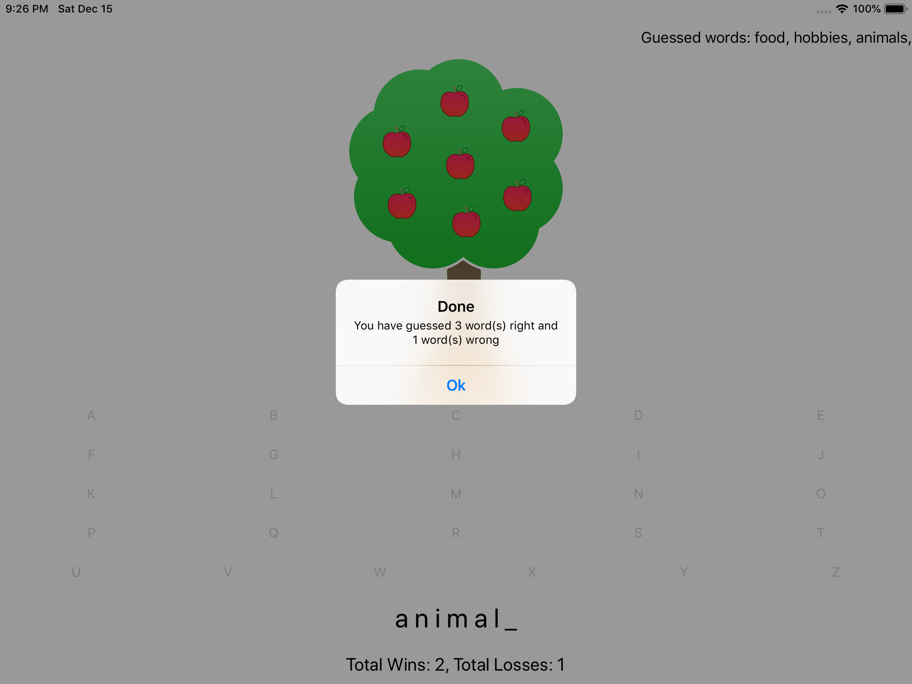

# Apple-Pie
## Initial Features
### -Play a game of hangman with build in words
### -Click letters to form the word
### -Form a word

## Added Features
### -Added a home screen
### -Added a multiplayer function
### -Added an option to enter your own words when choosing multiplayer or play with build in words
### -Added an option to enter an amount of 2 - 4 players
### -Added a screen to enter your own words
### -Added a label to see what player's turn it is when in multiplayer
### -Added a label where the user(s) can see what words they have guessed right
### -Added some error alerts

### Home
<kbd></kbd>

### Singleplayer In Game
<kbd></kbd>

### Singleplayer Done
<kbd></kbd>

### Multiplayer In Game
<kbd></kbd>

### Multiplayer Done
<kbd></kbd>

### Enter your own words screen
<kbd></kbd>

### Error: Enter a number between 2 - 4
<kbd></kbd>

### Error: Enter a number when choosing multiplayer
<kbd></kbd>

### Error: You can't play with your own words against yourself
<kbd></kbd>
